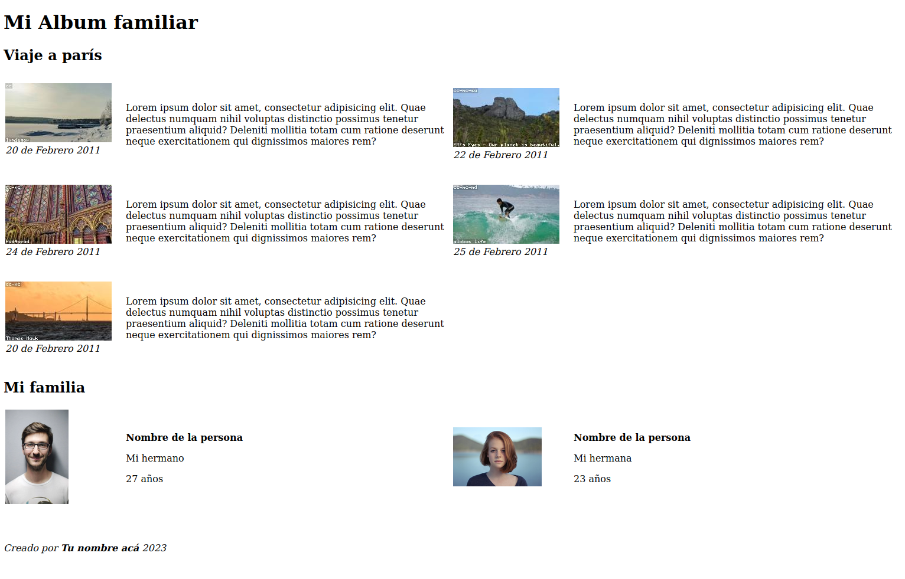
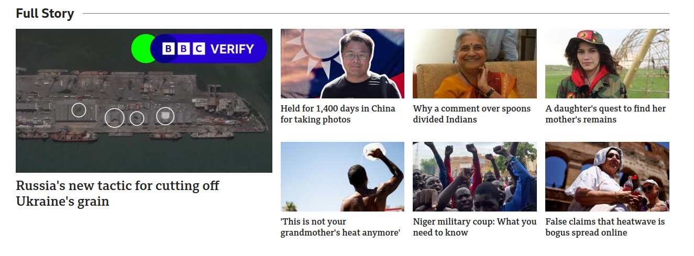

## Tarea

1.  Constuye un archivo HTML que tenga un contenido central dividido en 2 bloques, en un bloque incluye una imágen y en el otro un formulario de registro comos e ve en la imágen (puedes usar la siguiente imágen: https://www.kambcodelatam.com/_next/static/media/logo_small.2e076dcb.svg)
   

2.  Muchas veces queremos tener nuestras fotos organizadas y contar un poco de los recuerdos que ellas nos traen, para esto crea tu propio mini álbum de recuerdos completando los siguientes pasos:
    - Piensa en 5 viajes, momentos familiares y/o personas de las que quieras armar el recuerdo.
    - En tu documento HTML crea 5 secciones que tengan un título, una descripción de la sección, una tabla en la que organices las fotos que quieras incluir y finalmente junto a cada foto eso que te hace feliz al verla.
    - Finaliza tu mini álbum agregando un enorme título inicial y un pie de pagina (o una nueva seccion) donde incluyas tus datos, la fecha de realización.

A continuación te presentamos un ejemplo del album que debes crear:

3. *Tarea Extra:* Replicar el siguiente carusel de noticias usando tablas (individual)

Trabajar en parejas:

- Mauricio Bonilla - Juliana Gomez  (Study Room 1)
- Wilmer Gonzales - Carlos Cortes (Study Room 2)
- Jhon Lopez - Edison Escobar (Study Room 3)
- Mayerly Morales - Jonathan Suarez - Juan Cubillos (Study Room 4)
- Daniel Romero (Study Room 5)
- Luisa Pachon (Study Room 6)

