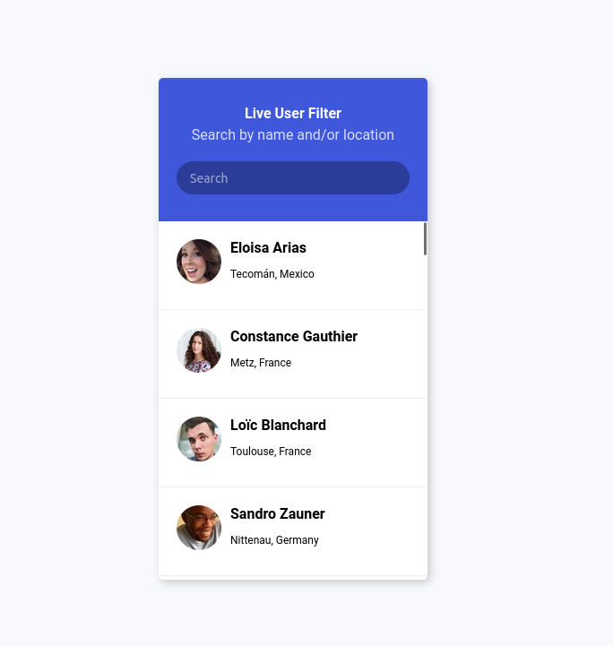

# Tareas del modulo

Las tareas de los módulos son pensadas para profundizar en los temas expuestos e interiorizar más el conocimiento.

## Tareas

1. Replica la siguiente tarjeta usando flexbox:
    - La tarjeta debe tener un ancho de `300px` y estar centrada en el body vertica y horizontalemente. No olvides usar la propiedad `min-height: 100vh` en el body.
    - Evita usar margin y padding para separar los elementos en su lugar usa flex-direction, justify-content, align-items, y gap
    - El contendor de usurios debe tener al menos 8 usuarios, pero unicamente deben aparecer 4 usuarios y se debe permitir hacer scroll para ver los demás. Para ello te recomendamos asignaler un alto (`height`) fijo al contendor de usuarios y utilizar la propiedad `overflow-y: scroll;`
    - 

## Trabajar en parejas:

- Mayerly Morales - Carlos Cortes (Study Room 1)
- Juan Cubillos - Edison Escobar (Study Room 2)
- Jhon Lopez - Wilmer Gonzales (Study Room 3)
- Juliana Gomez (Study Room 4)
- Mauricio Bonilla - Daniel Romero -Jonathan Suarez (Study Room 5)
- Jose Daniel Bocanegra (Study Room 6)