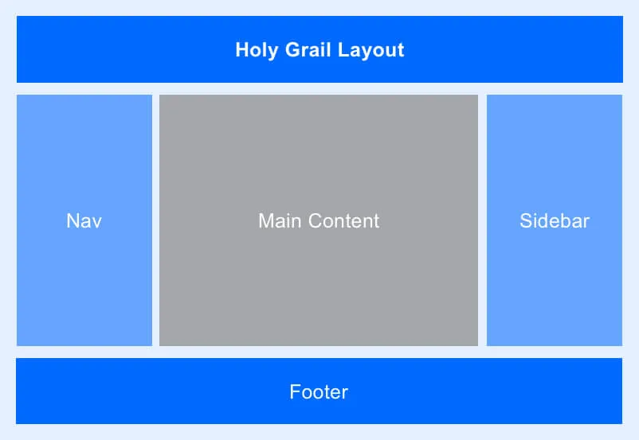

# Tareas del modulo

Las tareas de los módulos son pensadas para profundizar en los temas expuestos e interiorizar más el conocimiento.

## Tareas

Aplica los estilos dados según las condiciones especificadas de manera de llegar a la imagen ejemplo, recuerda que en cuanto a estilos hay infinitas maneras de llegar a la misma solución:

1. Dado el HTML de la primera tarea aplica los estilos css grid para convertirlo en la siguiente imagen. - 

2. Dado el HTML segundaTarea.html haciendo uso de las herramientas aprendidas de CSS grid, llega a la siguiente imagen

   - 

3. Usando CSS grid áreas desarrolla la siguiente layout

   - 

4. Tarea final de Grid, utilizando CSS grid desarrolla la siguiente layout

   - 

## Trabajar en parejas:

- Mayerly Morales - Carlos Cortes (Study Room 1)
- Edison Escobar - Wilmer Gonzales - Jonathan Suarez (Study Room 2)
- Jhon Lopez - Juliana Gomez (Study Room 3)
- Daniel Romero (Study Room 4)
- Mauricio Bonilla - Jose Daniel Bocanegra (Study Room 5)

