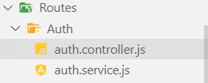

# Backend II

En el modulo anterior vimos la introducción a express, que como vimos es la librería principal de backend de NodeJS, finalizamos el módulo anterior con un resumen del proyecto que vamos a realizar a lo largo de esta documentación tecnica con el fin de entender temas como la organización de un proyecto y varias implementaciones de buenas practicas, este proyecto como mencionamos va a tratar de el manejo de tareas o como son comunmente llamadas `To Do`, miremos entonces como formariamos nuestro proyecto.

## Proyecto

Lo primero es entender que funciones va a cumplir nuestro proyecto a desarrollar. En resumen queremos un backend para gestionar el registro, edición y eliminación de estos to do, por supuesto, como añadido vamos a mirar como agregar autenticación a nuestro sistema de manera que cada usuario pueda tener sus propios To-Do.

Lo primero que debemos hacer es configurar nuestro proyecto de express, miremoslo.

- Lo primero que haremos es inicializar nuestro proyecto con el comando `npm init` e instalar nuestras dependencias, empezaremos con `express` y `nodemon`.
  ```
  npm install nodemon express
  ```
- Luego configuraremos un comando `npm watch dev` para el comando `nodemon index.js` de manera de utilizar nodemon

Antes de continuar con el proyecto, miremos antes la autenticación y como se implementa.

## Autenticación

La autenticación y autorización son usados como implementaciones de seguridad que se encargan de validar y permitir el acceso al sistema, cabe destacar la diferencia entra autenticación y autorización donde autenticación sería el permitir el acceso y la autorización sería el que se puede hacer con dicho acceso.

### JWT

Los JWT o JSON Web Tokens son un standard el cual representa la comunicación entre dos elementos y la autenticación que se da entre ellos, este contiene información de varios tipos como información de la sesión y del usuario autenticado, tienen metodos de cifrado muy seguros lo que los hace claves en la gestión de auntenticaciones de aplicaciones.

Lo que se busca con un JWT es contener cifrada toda la información de login de un usuario, de manera que cuando este porte su JWT pueda acceder a funcionalidades que requieran de autenticación, este puede contener cuanta información le demos y también tiene un elemento importante y es la validez del token, podemos asignarle la que queramos, pueden ser horas o minutos pero lo que se hace con esa duración es darle una caducidad a un determinado JWT. Miremos como se implementaría como ejemplo con el ejercicio practico.

Lo primero que haremos es instalar unas dependencias para el cifrado de las contraseñas, la gestión del JWT y para las variables de entorno.

```cmd
npm install jsonwebtoken dotenv bcryptjs
```

Para el desarrollo de este ejercicio se requiere de persistencia de datos, tema que veremos en modulos futuros que trata con el como almacenamos nuestros datos de manera que al reiniciar la aplicación estos no se pierdan, en este caso guardaremos los datos de nuestros usuarios y sus ToDo en ficheros de texto.

Lo primero que vamos a hacer es generar un folder para la autenticación, donde tendremos el controlador y el servicio encargados de esto.



Luego, generaremos las rutas y simplemente llamaremos a los servicios de login y register los cuales desarrollaremos a continuación.

```js
import express from "express";
import { AuthService } from "./auth.service.js";
const AuthRouter = express.Router();
const authService = new AuthService();

AuthRouter.get("/", (req, res) => {
  res.send("Auth Router Ok");
});

AuthRouter.post("/register", async (req, res) => {
  const registerResult = await authService.register(req);
  console.log(registerResult);
  res.status(registerResult.statusCode).json(registerResult);
});

AuthRouter.post("/login", async (req, res) => {
  const loginResult = await authService.login(req);
  res.status(loginResult.statusCode).json(loginResult);
});

export { AuthRouter };
```

Como vemos, entonces vamos a esperar que el servicio retorne una estructura con statusCode y mas opcionales.

Luego, miremos el modelo, que es donde plantearemos las operaciones con nuestros usuarios, este modelo lo crearemos en una carpeta llamada `common` que es donde vamos a tener los modulos comunes entre modulos de nuestra aplicación.

```js
import fs from "fs/promises";
import bcrypt from "bcrypt";

export class UserModel {
  constructor() {}

  async createUser(userData) {
    const existingData = await fs.readFile("./common/userData.txt");
    const existingUsers = JSON.parse(existingData);
    console.log(existingUsers);
    const existingEmail = existingUsers.filter(
      (user) => user.email === userData.email
    );
    if (existingEmail[0]) {
      return { error: "Email already registered" };
    } else {
      const encryptedPassword = await bcrypt.hash(userData.password, 10);
      existingUsers.push({
        first_name: userData.first_name,
        last_name: userData.last_name,
        email: userData.email.toLowerCase(),
        password: encryptedPassword,
      });
      await fs.writeFile(
        "./common/userData.txt",
        JSON.stringify(existingUsers)
      );
      const id = existingUsers.length - 1;
      return {
        id,
        first_name: userData.first_name,
        last_name: userData.last_name,
        email: userData.email.toLowerCase(),
        password: encryptedPassword,
      };
    }
  }

  async findUser(userData) {
    const existingData = await fs.readFile("./common/userData.txt");
    const existingUsers = JSON.parse(existingData);
    const user = existingUsers.find(
      (existingUser) => existingUser.email === userData.email
    );

    if (!user) {
      return { error: "Email not registered" };
    } else {
      const id = existingUsers.indexOf(user);
      user.id = id;
      return user;
    }
  }
}
```

Generamos dos funciones, una para crear un nuevo usuario, que usando un fichero llamado `userData` valida que nuestro correo dado no esté registrado ya, luego, si no está registrado ingresa el nuevo usuario y retorna la información de este con un ID dado por el indice en el arreglo de usuarios.

La segunda función nos sirve para retornar el usuario con su respectivo ID si se encuentra en la base de datos, esta la utilizaremos para el login, miremos entonces el servicio de auth.

```js
import { UserModel } from "../../common/users.model.js";
import dotenv from "dotenv";
dotenv.config();
import jwt from "jsonwebtoken";
import bcrypt from "bcrypt";

export class AuthService {
  constructor() {
    this.userModel = new UserModel();
  }

  async register(req) {
    try {
      const { first_name, last_name, email, password } = req.body;
      if (!(email && password && first_name && last_name)) {
        return { statusCode: 500, message: "All input is required" };
      }
      const user = await this.userModel.createUser(req.body);
      if (user.error)
        return { statusCode: 400, message: "Email already registered" };

      const token = jwt.sign(
        { user_id: user.id, email },
        process.env.TOKEN_KEY,
        { expiresIn: "2h" }
      );
      user.token = token;
      return {
        statusCode: 200,
        message: "Registered successfully",
        user,
      };
    } catch (err) {
      console.error(err);
      throw new Error(err);
    }
  }

  async login(req) {
    try {
      const { email, password } = req.body;
      if (!(email && password)) {
        return { statusCode: 500, message: "All input is required" };
      }

      const user = await this.userModel.findUser(req.body);
      console.log(user);

      if (user && (await bcrypt.compare(password, user.password))) {
        const token = jwt.sign(
          { user_id: user.id, email },
          process.env.TOKEN_KEY,
          { expiresIn: "2h" }
        );

        user.token = token;
        return {
          statusCode: 200,
          message: "Registered successfully",
          user,
        };
      } else {
        return {
          statusCode: 400,
          message: "Verify email or password",
        };
      }
    } catch (err) {
      console.error(err);
      return { statusCode: 500, message: "All input is required" };
    }
  }
}
```

Aquí es donde toda la magia sucede, como vemos, desde el controlador pasamos los parametros a los servicios, los cuales register, se encarga de intentar crear el usuario, si la creación es exitosa, entonces procederá a retornar exito con el JWT, este JWT como vemos se genera en base a la información del usuario y a una clave secreta que tenemos en nuestras variables de entorno, como vemos le asignamos un tiempo de 2 horas antes de expirar.

Por otro lado, viendo la función de login, vemos como hacemos uso de findUser que creamos en el modelo de user para obtener el usuario, luego comparamos la contraseña y si es la correcta se autentica el usuario retornando el token, si no es la correcta se retorna un mensaje de error.

Ya implementada la manera de obtener el token y en general la gestión de nuestros usuarios, miremos ahora como protegemos nuestros endpoints con autenticación de manera que obliguemos al usuario a identificarse antes de poder realizar operaciones con la aplicación.

Para esto vamos a generar un middleware el cual vamos a implementar en los controladores que requiramos, en este caso, vamos a crear para el proyecto un controlador llamado toDo, este se va a encargar de permitirle a los usuarios interactuar con sus ToDo, entonces vamos a requerir de saber que usuario está realizando las peticiones para saber que a que ToDos tiene acceso.

Miremos entonces como sería el Middleware.

```js
import jwt from "jsonwebtoken";

export function verifyToken(req, res, next) {
  const token =
    req.body.token || req.query.token || req.headers["x-access-token"];

  if (!token) {
    return res.status(403).send("A token is required for authentication ");
  }

  try {
    const decoded = jwt.verify(token, process.env.TOKEN_KEY);
    req.user = decoded;
  } catch (err) {
    return res.status(401).send("Invalid token");
  }

  return next();
}
```

Como vemos lo que hace este middleware es tomar un token el cual podemos enviar en distintas maneras y haciendo uso de la llave secreta de nuestros tokens y de el mismo token, validar si se le autentica el acceso al usuario, en caso positivo, como vemos se agrega al req.user el usuario, de manera que podamos identificarlo y saber que información puede recibir dentro de la aplicación, si tuvieramos una aplicación mas compleja con distintos permisos, esto nos serviría para saber que permisos puede tener el usuario.

Entonces, como los endpoints de nuestro controllador de Todo queremos que estén protegidos por autenticación, vamos a implementar en el controlador de Todo nuestro middleware, como lo hemos hecho antes como por ejemplo para implementar el logger, de la misma manera implementamos un middleware de autenticación, miremos.

```js
import express from "express";
const TodoRouter = express.Router();
import { verifyToken } from "../../Middleware/auth.js";

TodoRouter.use(verifyToken);

TodoRouter.get("/", (req, res) => {
  res.send(`New Request ${req.path}}`);
});

export { TodoRouter };
```

De esta manera ya tenemos implementada la validación de autenticación en nuestro controlador de To Do.

Teniendo clara la autenticación y habiendola implementado ya en nuestra aplicación pasemos ahora a desarrollar la funcionalidad de los To Do para que nuestros usuarios puedan gestionarlos.

Empecemos desarrollando un modelo también pero en este caso de ToDo de manera que los podamos almacenar al igual que lo hacemos con lo usuarios.

Miremos entonces el modelo, en este crearemos los metodos para interactura con el modelo de datos, en este caso los todo.

```js
import fs from "fs/promises";
import bcrypt from "bcrypt";

export class TodoModel {
  constructor() {}

  async createTodo(todoData, userData) {
    const existingData = await fs.readFile("./common/todoData.txt");
    let existingTodos = existingData ? JSON.parse(existingData) : [];
    const todoId = existingTodos.filter(
      (todo) => todo.userId === userData.user_id
    ).length;
    todoData.id = todoId;
    todoData.completed = false;
    todoData.userId = userData.user_id;
    existingTodos.push(todoData);
    await fs.writeFile("./common/todoData.txt", JSON.stringify(existingTodos));
    return todoData;
  }

  async findTodo(userId, todoId) {
    const existingData = await fs.readFile("./common/todoData.txt");
    let existingTodos = existingData ? JSON.parse(existingData) : [];
    if (todoId) {
      const todo = existingTodos.filter(
        (todo) => todo.userId == userId && todo.id == todoId
      );

      if (todo[0]) {
        return todo[0];
      } else {
        return { error: "Todo not found" };
      }
    }
    const todos = existingTodos.filter((todo) => todo.userId == userId);
    return todos;
  }

  async deleteTodo(userId, todoId) {
    const existingData = await fs.readFile("./common/todoData.txt");
    let existingTodos = existingData ? JSON.parse(existingData) : [];
    if (todoId) {
      const todo = existingTodos.filter(
        (todo) => todo.userId == userId && todo.id == todoId
      );

      if (todo[0]) {
        const index = existingTodos.indexOf(todo[0]);
        const deleted = existingTodos.splice(index, 1);
        await fs.writeFile(
          "./common/todoData.txt",
          JSON.stringify(existingTodos)
        );
        return { deleted };
      } else {
        return { error: "Todo not found" };
      }
    }
    const todos = existingTodos.filter((todo) => todo.userId == userId);
    return todos;
  }

  async updateTodo(userId, todoData) {
    const existingData = await fs.readFile("./common/todoData.txt");
    let existingTodos = existingData ? JSON.parse(existingData) : [];
    const todo = existingTodos.filter(
      (todo) => todo.userId == userId && todo.id == todoData.id
    );

    if (todo[0]) {
      const index = existingTodos.indexOf(todo[0]);
      const editted = existingTodos[index];
      const newTodo = {
        title: todoData.title,
        description: todoData.description,
        completed: todoData.completed,
        id: editted.id,
        userId: editted.userId,
      };
      existingTodos[index] = newTodo;
      await fs.writeFile(
        "./common/todoData.txt",
        JSON.stringify(existingTodos)
      );
      return { editted };
    } else {
      return { error: "Todo not found" };
    }
  }
}
```

Como notamos, cada función recibe lo estrictamente necesario para poder desempeñar la tarea deseada y como extra, siempre reciben el id del usuario, esto para que un usuario no tenga acceso a todos de otro usuario y tampoco los pueda modificar.

En todo momento antes de operar se verifica tanto el id del todo como el id del usuario y que estos dos correspondan, recordemos que el id del usuario siempre se toma del token con el que se realizó la petición, de esta manera nos aseguramos de que ningún usuario intente suplantar a otro.

Miremos ahora el servicio.

```js
import { TodoModel } from "../../common/todoModel.js";

export class TodoService {
  constructor() {
    this.todoModel = new TodoModel();
  }

  async createTodo(req) {
    console.log(req.user);
    const { title, description } = req.body;
    if (!(title && description)) {
      return {
        statusCode: 400,
        message: "Please provide all the params",
      };
    }
    const response = await this.todoModel.createTodo(req.body, req.user);
    return { statusCode: 200, todo: response };
  }

  async getTodo(req) {
    const { todoId } = req.query;
    if (todoId) {
      return {
        statusCode: 200,
        todo: await this.todoModel.findTodo(req.user.user_id, todoId),
      };
    } else {
      return {
        statusCode: 200,
        todos: await this.todoModel.findTodo(req.user.user_id),
      };
    }
  }

  async deleteTodo(req) {
    const { todoId } = req.body;
    if (!todoId) {
      return {
        statusCode: 400,
        message: "Please provide the todo id to delete",
      };
    }
    return {
      statusCode: 200,
      todo: await this.todoModel.deleteTodo(req.user.user_id, todoId),
    };
  }

  async updateTodo(req) {
    const { title, description, id, completed } = req.body;
    if (!(title && description && id && completed)) {
      return {
        statusCode: 400,
        message: "Please provide all the data to update",
      };
    }

    return {
      statusCode: 200,
      todo: await this.todoModel.updateTodo(req.user.user_id, req.body),
    };
  }
}
```

Como vemos, la responsabilidad de modificar los datos se le designa al modelo, luego, en el servicio lo único que hacemos es llamar al modelo y verificar que tanto la respuesta como los parametros correctos están siendo comunicados.

Miremos ahora el controlador en su estado final.

```js
import express from "express";
import { AuthService } from "./auth.service.js";
const AuthRouter = express.Router();
const authService = new AuthService();

AuthRouter.get("/", (req, res) => {
  res.send("Auth Router Ok");
});

AuthRouter.post("/register", async (req, res) => {
  const registerResult = await authService.register(req);
  console.log(registerResult);
  res.status(registerResult.statusCode).json(registerResult);
});

AuthRouter.post("/login", async (req, res) => {
  const loginResult = await authService.login(req);
  res.status(loginResult.statusCode).json(loginResult);
});

export { AuthRouter };
```

Como vemos el controlador solo se encarga de definir las rutas, llamar a los servicios y de retornar la respuesta al cliente, a esto se le llama segregación de responsabilidades.

Ahora miremos el router, el cual se encarga de tomar todas las rutas definidas por los controladores y unificarlas.

```js
import express from "express";
import { TodoRouter } from "./ToDo/todo.controller.js";
import { AuthRouter } from "./Auth/auth.controller.js";
const AppRouter = express.Router();

AppRouter.use("/todo", TodoRouter);
AppRouter.use("/auth", AuthRouter);

export { AppRouter };
```

Como vemos, el router es el que unifica las rutas para que finalmente en index.js sean definidas en un mismo endpoint base o como lo conocemos `el URL base`.

```js
import express from "express";
import { logger } from "./Middleware/logger.js";
import { AppRouter } from "./Routes/router.js";

const app = express();
const PORT = 3000;
app.use(logger);
app.use(express.json());
app.use("/api/V1", AppRouter);

app.listen(PORT, () => {
  console.log(`Server listening at port: ${PORT}`);
});
```

Con todo finalizado, nuestra aplicación está lista, un API Backend CRUD completo con autenticación.

## Final del módulo

Llegamos al final del módulo donde comprendimos la estructura basica de un proyecto de nivel productivo de express, por supuesto hay muchas mas herramientas complejas a implementar como puede ser bases de datos reales para la persistencia de datos, un middleware mas avanzado de logging y entre otros, pero con estas herramientas que hemos visto están construidas miles de aplicaciones productivas a nivel profesional. En módulos siguientes haremos mas enfasis en la persistencia de datos y en general en buenas practicas para cerrar el ciclo de las aplicaciones productivas.
