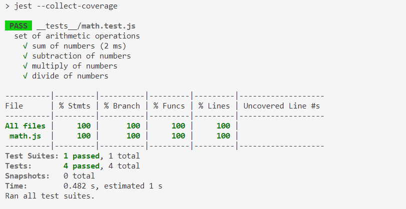

# Testing

En este módulo vamos a ver una practica que es fundamental en todo proyecto de nivel productivo, la cual muchas veces dejamos por alto y no le prestamos atención a su importancia hasta que es demasiado tarde y tenemos una deuda tecnica gigante, nuestro proyecto es muy grande y hacerle modificaciones asegurandonos de que no vamos a dañar procesos ya existentes es demasiado complicado, miremos entonces, que es el testing y de donde su importancia.

Tradicionalmente la manera de testear aplicaciones era desplegandolas en servidores de pruebas y ejecutando manualmente una serie de casos pre definidos en un script de pruebas con la idea de verificar que todo está funcionando correctamente, sin embargo, esto no es una practica sostenible y mucho menos eficiente, estamos hablando de un ambiente completamente solo destinado a realizar pruebas manuales y mas alla de eso, cuando trabajamos con software que no para de crecer, así mismo estas pruebas van a ser cada vez mas tediosas y demoradas. La solución que se planteo es una automatización completa desde el compilado hasta el despliegue en producción de la aplicación.

La automatización de pruebas no es mas que una preparación, ejecución y reporte de resultados de pruebas de software sin interacción humana. Por supuesto estamos hablando de un proceso que le va a agregar complejidad al proyecto, que tanta depende de como sean los lineamientos del proyecto pero en general con las pruebas, entre mas mejor. Sin embargo, la eficiencia que se logra en el flujo de desarrollo cuando implementamos pruebas es sin duda un factor para enfatizar en estas tanto como se hace en los proyectos de alto nivel.

Imaginate realizar un simple refactor de código de una aplicación gigante, donde cada módulo se habla con los demas y tenemos unos 6 modulos distintos, luego de realizar un cambio por pequeño que sea, la única manera de asegurarnos de que no hemos dañado algún otro proceso que ya estaba funcionando sería testeando todo, ahora imaginate testear 6 módulos por un simple refactor. Al implementar pruebas, cada que realizamos un cambio por gigante que sea tendremos todo listo para en cualquier momento verificar el estado de la aplicación, si todo sigue funcionando correcto o si algo dejó de funcionar, qué es.

Así entonces miremos un concepto fundamental en el entendimiento de los tipos de pruebas que existen.

## Piramide de Test


Los 3 niveles de la piramide representan los 3 distintos tipos de pruebas que existen, sin embargo, los nombres de estos niveles tienen a diferir según la interpretación, la convención mas utilizada es que la base de la piramide son los `test unitarios`, luego siguen los `test de integración` y finalmente están los `test e2e ó test end to end`.

En las flechas en los extremos de las piramides podemos ver dos escalas importantes, como vemos la base de la piramide o las `pruebas unitarias` son mas rapidas y aisladas, y conforme subimos encontramos que se crece en complejidad de las pruebas, por tanto se vuelven mas lentas y mas integradas, con esto a lo que nos referimos es que la base de la piramide serían las pruebas que realizamos sobre cada funcionalidad aislada de la aplicación, literalmente cada función helper que tengamos, cada elemento mas micro de nuestro desarrollo será testeado mediante las `pruebas unitarias`.

Luego, los `test de integración` son aquellos que juntan varios componentes micro o funcionalidades independientes y conforman los servicios como se llama dicho nivel en la piramide ejemplo, entonces, estos tests al involucrar mas elementos por supuesto son mas tediosos de configurar pero son fundamentales también porque son los que validan que no cada funcionalidad esté funcionando de manera aislada sino que al integrar funcionalidades para construir servicios estas funcionan como se espera.

Finalmente tenemos los test de UI como se menciona en la piramide ó los mas comunmente llamados `test e2e`, estos se encargan de simular lo que sería la interacción de un usuario final con el aplicativo, por eso también se les llamad UI test aunque no siempre nuestro usuario final va a interactuar con una interfaz grafica. Estos tests con sin duda los mas complejos porque debe configurarse cuantos casos de uso de puedan configurar y eso requiere de entender la interacción que va a tener el usuario final con la aplicación y mas alla de eso requiere de configurar cada elementos de la aplicación para que funcione en base a las pruebas esperadas.

Por supuesto, la piramide también indica la cantidad de pruebas que se sugiere, siempre se sugiere una gran cantidad de pruebas unitarias, luego unas menos de integración y finalmente unas pocas e2e.

Por supuesto, al seguir las recomendaciones de los test no necesariamente se suple la necesidad de un stage de QA y de personas especializadas en la realización de pruebas que saben como llevar nuestra aplicación al limite con casos de uso totalmente utopicos y pensados en cada posible opción, sin embargo, lo que si nos garantiza es que al menos desde el punto de vista del desarrollo estamos desplegando y enviando a pruebas una aplicación con una gran cantidad de filtros en cuanto a posibles errores que podría presentar, por tanto, agiliza todo el proceso de CI/CD de una manera muy eficiente.

Existen muchas librerías o frameworks distintos para la realización de pruebas, así como existen librerías para servidores http o para request, sin embargo, como siempre, hay unas recomendadas por el soporte de la comunidad, la robustes y en general las opciones que nos ofrece o los beneficios, miremos uno de los frameworks principales de testing.

## Testing con Jest


Jest es un framework de testing con Javascript, es el framework mas utilizado en la actualidad por su versatilidad de adaptarse con muchisimos frameworks modernos como React, Angular, NestJS, entre otros.

Puedes encontrar su pagina web para leer directamente toda su información y documentación [aquí](https://jestjs.io/).

Jest tiene un 3 elementos básicos los cuales se apoyan en otro mas avanzados para realizar pruebas mas complejas, pero al final si miramos cualquier tipo de prueba por compleja que sea la podemos descomponer en estos 3 elementos.

- `Describe:` Función que nos ayudará a crear bloques que agrupan varias pruebas relacionadas
- `Test:` Función donde se realizará la prueba, en el caso de la mayoría de pruebas encontraras este concepto como `test` sin embargo para el caso de Jest esta función toda el nombre de `it`
- `Expect:` Función que nos permite validar las coincidencias durante las pruebas, en base a la configuración de estas funciones expect es que Jest validará el resultado de la prueba.

Miremos entonces un ejemplo básico de la estructura de una prueba.

```js
describe("set of math test", () => {
  test("it is pair", () => {
    expect(6 % 2).toEqual(0);
  });
  test("it is not pair", () => {
    expect(7 % 2).not.toEqual(0);
  });
});
```

Como vemos describe genera un bloque de pruebas relacionadas, en este caso un bloque de pruebas matematicas donde luego con test se describen dos pruebas distintas donde cada una mediante el uso de un expect define la prueba a realizar.

Miremos la configuración de un proyecto para hacer ejemplos practicos sobre los diferentes elementos de un set de pruebas de Jest.

### Instalación

Lo primero que debemos hacer es inicializar un nuevo proyecto de NodeJS, como lo hemos hecho siempre, con el comando `npm init` y luego instalar Jest, lo guardaremos como una dependencia de desarrollo pues en un build productivo no lo necesitaremos.

```
> npm init -y
> npm i jest --save-dev
```

Luego, configuraremos en nuestro `package.json` los siguientes scripts

```json
{
  "name": "ejercicioclase",
  "version": "1.0.0",
  "description": "",
  "main": "index.js",
  "scripts": {
    "test": "jest",
    "coverage": "jest --collect-coverage"
  },
  "keywords": [],
  "author": "",
  "license": "ISC",
  "devDependencies": {
    "jest": "^29.4.3"
  }
}
```

Ahora tenemos todo listo para empezar a construir nuestras pruebas.

Por supuesto, vamos a necesitar un desarrollo que testear, para esto vamos a simular un pequeño desarrollo creando un archivo llamado `math.js` con el siguiente contenido.

Luego de que tengamos nuestro archivo ahora si estamos listos para empezar a desarrollar pruebas, lo que debemos hacer es crear un folder llamado `__tests__` y dentro estarán nuestras pruebas, lo común es que las pruebas se llamen como el archivo que vamos a testear con la extesión `.test.js`, entonces si vamos a testear `math.js` el archivo de pruebas se llamaría `math.test.js`.

> Jest por defecto busca la carpeta `__tests__` y ejecuta como pruebas todo archivo con extensión `.spec.js` o `.test.js`, por tanto si nuestras pruebas están ubicadas en otras direcciones tendremos que generar un archivo de configuración de Jest.

Aquí vamos a insertar una prueba para cada función de manera de verificar cual es el resultado que deberían estar dando las funciones. Miremos el siguiente script

```js
const { sum, sub, mul, div } = require("../math.js");

describe("set of arithmetic operations", () => {
  test("sum of numbers", () => {
    expect(sum(1, 1)).toBe(2);
  });
  test("subtraction of numbers", () => {
    expect(sub(1, 1)).toBe(0);
  });
  test("multiply of numbers", () => {
    expect(mul(1, 1)).toBe(1);
  });
  test("divide of numbers", () => {
    expect(div(1, 1)).toBe(1);
  });
});
```

Entonces, utilizando el comando que configuramos de `npm run test` podemos ver el resultado de cada una de nuestras pruebas.


Como vemos en la salida del mensaje, lo que indica es que todos los test cumplieron y por tanto todos salieron correctos, luego, miremos el reporte de cobertura que es el otro comando que configuramos en un inicio en nuestro package.json y es el del coverage, este comando para lo que nos sirve es para un resumen del estado de coverage en cuanto a pruebas, entonces, ejecutando `npm run coverage`.



Como vemos en este caso todos los scripts presentes tienen pruebas asociadas y todas sus funciones también por lo que el coverage arroja 100% que es por supuesto lo ideal para todos los casos, sin embargo, no siempre es tan sencillo llegar a ese coverage de 100%.

Esto que hemos visto hasta ahora es el flujo completo de un proyecto de Jest, un flujo donde configuramos las pruebas, creamos el folder para esta, las desarrollamos y finalizamos con la ejecución de esta.

Ahora miremos de estos elementos que vimos basicos cuales son las posibilidades que ofrece Jest para realizar pruebas mucho mas complejas.

## Matchers

Los matchers son la manera como Jest evalua nuestros resultados finales, es la manera de validar la respuesta final de nuestro proceso y en general de nuestra prueba, los matchers se utilizan en conjunto con la función `expect()` la cual genera un objeto de "expectativa" el cual luego puede ser evaluado con la ayuda de matchers.

Miremos algunos de los matchers mas utilizados.

- `toBe()` utiliza `Object.is` para testear la igualdad, si mas que el objeto como tal quieres validar el valor del objeto se utiliza el siguiente matcher
- `toEqual()` evalua de manera recursiva los valores de un arreglo u objeto, este matcher ignora las llaves de un objeto con `undefined`, de arreglos o objetos indefinidos, para no ignorar estos casos podemos usar el siguiente matcher
- `toStrictEqual()` funciona de manera muy similar al matcher anterior solo que como se mencionó, este no ignora referencias indefinidas dentro de los objetos o arreglos por lo que es un matcher mucho mas preciso y estricto.

### Matchers de veracidad

Estos matchers sirven para validar la verdad de ciertas sentencias. Miremos cuales son:

- `toBeNull()` hace match valido solo con `null`
- `toBeUndefined()` hace match solo con `undefined`
- `toBeDefined()` es el opuesto de `toBeUndefined()` sería como si utilizaramos un `not`
- `toBeTruthy()` hace match con cualquier sentencia que un if retorne verdadero
- `toBeFalsy()` hace match con cualquier sentencia que un if retorne falso
- `not` Nos sirve para negar cualquier otro matcher. Ej `expect(n).not.ToBeTruthy()`

### Matchers numericos

Nos sirven para hacer comparaciones con valores numericos.

- `toBeGreaterThan(n)` Validamos que el valor es mayor que n
- `ToBeGreaterThanOrEqual(n)` Validamos que el valor es mayor o igual a n
- `toBeLessThan(n)` Validamos que el valor sea menor a n
- `toBeLessThanOrEqual` Validamos que el valor sea menor o igual a n

### Matcher de Strings

Nos sirven para comparar strings con patrones dados.

- `toMatch()` Nos permite utilizar patrones para comparar con el string dado. Ej `/stop/`

### Matcher de Arreglos e iterables

Nos sirven para validar elementos o caracteristicas de un arreglo o cualquier tipo de iterable.

- `toContain(n)` Nos permite validar si un iterable contiene el elemento n

### Matcher de excepciones

Por supuesto los casos de pruebas también contemplan casos donde la aplicación falla, haciendo uso del matcher de excepciones podemos validar la excepción dada y su contenido.

- `toThrow(e)` Valida que la expeción e fue arrojada de cierta función

Esta es una lista de los matchers mas utilizados, sin embargo, la lista es muchisimo mas extensa e incluso existen librerías para agregar matchers personalizados a Jest, para leer mas sobre los originales de Jest puedes acceder al siguiente [link](https://jestjs.io/docs/expect).

## Supertest

Supertest es una librería pensada para utilizarse con cualquier framework de testing pero que también funciona sin ninguno de ellos, supertest es un módulo con interface Fluent API que nos provee un nivel de abstracción para facilitar la prueba de servicios http.

Supertest está construida sobre `superagent` que es un cliente http el cual nos facilita esta interfaz para pruebas.

Entonces supertest mas alla de proporcionarnos esta interfaz para pruebas también nos proporciona matchers dedicados a testear el funcionamiento de nuestras distintas funciones. Miremoslos.

- `expect(status[, fn])` verifica el código de estado de la respuesta.

- `expect(status, body[, fn])` verifica el código de estado de la respuesta y el body.

- `expect(body[, fn])` verifica el body con un string, expresión regular o también un objeto parseado.

- `expect(field, value[, fn])` verifica una cabecera con un string o expresión regular.

- `expect(function(res) {})` función de verificación personalizada, recibe el objeto de respuesta. Si la respuesta esta ok debería devolver false o no devolver nada. Si la vericación falla debemos devolver un error o un string especificando porque ha fallado la verificación.

Miremos entonces como implementariamos supertest.

Lo primero es su instalación, vamos a instalar express para generar un servidor http para testearlo y también supertest por supuesto para las pruebas.

```
> npm install supertest --save-dev
> npm install express
```

Luego, en un archibo `index.js` vamos a copiar un servidor que desarrollamos en modulos anteriores, a continuación el código.

```js
const express = require("express");
const app = express();
const port = 3000;

app.use(express.json());

app.use((req, res, next) => {
  console.log(
    `New Request: ${req.method} | ${
      req.originalUrl
    } | ${new Date().toISOString()}`
  );
  next();
});

const books = [
  {
    bookId: 1,
    author: "Perano",
    name: "The hapiness book",
    gender: "Self Care",
  },
  {
    bookId: 2,
    author: "Sultano",
    name: "The blue man",
    gender: "Fantasy",
  },
  {
    bookId: 3,
    author: "Mendano",
    name: "How to build habits",
    gender: "Self Care",
  },
  {
    bookId: 4,
    author: "Mendano",
    name: "How to be rich",
    gender: "Self Care",
  },
  {
    bookId: 4,
    author: "Mendano",
    name: "How to be badass",
    gender: "Action",
  },
];

app.get("/", (req, res) => {
  res.status(200).json({ message: "Hello World!" });
});

app.post("/books", (req, res, next) => {
  if (req.body.author && req.body.bookId && req.body.name && req.body.gender) {
    next();
  } else {
    res.json({ status: 400, message: "Error on given parameters" });
  }
});

app.all("/ping", (req, res) => {
  res.send("Server PING success!");
});

app.get("/books/:bookId", (req, res) => {
  console.log(req.params);
  if (req.params.bookId === "all") {
    res.send({
      status: 200,
      message: "Query executed successfully",
      data: books,
    });
  } else {
    const results = books.filter((book) => book.bookId == req.params.bookId);
    res.send({
      status: 200,
      message: "Query executed successfully",
      data: results,
    });
  }
});

app.get("/booksQuery", (req, res) => {
  console.log(req.query); // { bookId: '3' }
});

app.post("/books", (req, res) => {
  console.log(req.body);
  books.push(req.body);
  res.json({
    status: 200,
    message: "Query executed successfully",
    inserted: req.body,
  });
});

app.get("/genders/:gender/authors/:author", (req, res) => {
  console.log(req.params);
  const results = books.filter(
    (book) =>
      book.gender == req.params.gender && book.author == req.params.author
  );
  res.send({
    status: 200,
    message: "Query executed successfully",
    data: results,
  });
});

module.exports = app;
```

Como vemos vamos a quitar la sentencia de app.listen() para que cada que se ejecute una prueba esta sea la encargada de iniciar el servidor y no que cada que se llame este se inicie solo porque presentaríamos errores.

Luego, tendremos que exportar como vemos en la ultima linea nuestro app que contiene el servidor de express con el fin de importarlo desde las pruebas para generar servidores de pruebas.

Miremos ahora el código del test.

```js
const supertest = require("supertest");
const app = require("../index.js");
const request = supertest(app);

describe("GET Hello world", () => {
  it("Should return status code 200", async () => {
    const res = await request.get("/");
    expect(res.status).toBe(200);
  });
});
```

Como vemos, usando `supertest` y el `app` que exportamos el cual contiene la definición de nuestro servidor podemos generar lo que sería un `mock`, concepto que vamos a ver mas adelante de nuestro servidor de manera que podamos acceder a objetos de respuestas.

Esta es una prueba bastante sencilla, miremos por ejemplo un caso en el que el request que vamos a probar requiere de un body para el request.

```js
describe("POST book", () => {
  it("Should return status code 400 because of empty params", async () => {
    const res = await request.post("/books").send({
      author: "TEST AUTHOR",
      bookId: "TEST BOOK-ID",
      name: "TEST NAME",
    });

    expect(res.status).toBe(400);
  });
  it("Should return status code 200", async () => {
    const res = await request.post("/books").send({
      author: "TEST AUTHOR",
      bookId: "TEST BOOK-ID",
      name: "TEST NAME",
      gender: "TEST GENDER",
    });

    expect(res.status).toBe(200);
  });
});
```

La petición POST de `/books` requiere de los 4 parametros listados en el segundo test, si no se envía alguno este endpoint arroja un error 400, como vemos en este caso realizamos dos pruebas, una donde falta un parametro por tanto esperamos que la respuesta sea 400 y otro donde todo se hace de manera correcta por tanto esperamos que sea 200 la respuesta. De esta manera con helpers de supertest podemos enviar en el request todos los elementos que queramos, sean headers, body params, query params y en general podemos configurar el request como queramos.

## Mocks y SpyOn

Pasemos ahora a ver dos conceptos avanzados cuando nos referimos a testing, como lo son los mocks y los spyon.

Las funciones `Mock` son funciones que nos permiten testear las integraciones entre funciones eliminando la implementación real de una función, capturando llamadas a la función (y los posibles parametros que lleven esos llamados), capturando instancias de las funciones constructor y permitiendo configurar en pruebas las respuestas de las funciones.

Hay dos maneras de hacer `mock` de funciones, creando una función mock para usar en el test o escribiendo un `mock` manual para sobreescribir la dependencia de un módulo.

Imaginemos que estamos testeando la implementación de una función `forEach` la cual involucra un callback para cada item de un arreglo dado.

```js
export function forEach(items, callback) {
  for (let index = 0; index < items.length; index++) {
    callback(items[index]);
  }
}
```

Para testear esta función podemos usar una función mock e inspeccionar el estado del mock con el fin de verificar que el callback se está invocando como se supone.

```js
const forEach = require("./forEach");

const mockCallback = jest.fn((x) => 42 + x);

test("forEach mock function", () => {
  forEach([0, 1], mockCallback);

  // The mock function was called twice
  expect(mockCallback.mock.calls).toHaveLength(2);

  // The first argument of the first call to the function was 0
  expect(mockCallback.mock.calls[0][0]).toBe(0);

  // The first argument of the second call to the function was 1
  expect(mockCallback.mock.calls[1][0]).toBe(1);

  // The return value of the first call to the function was 42
  expect(mockCallback.mock.results[0].value).toBe(42);
});
```

Todas las funciones mock tienen esta propiedad especial `.mock` que es donde está la información sobre la función, como ha sido llamada y que ha retornado.

Las propiedades de mock son muy utiles para testear como las funciones han sido llamadas, instaciadas o lo que han retornado.

```js
// La función ha sido llamada una vez
expect(someMockFunction.mock.calls).toHaveLength(1);

// Acceso al primer argumento de la primera llamada de la función
expect(someMockFunction.mock.calls[0][0]).toBe("first arg");

// Acceso al segundo argumento de la primera llamada de la función
expect(someMockFunction.mock.calls[0][1]).toBe("second arg");

// El valor retornado de la primera llamada de la función
expect(someMockFunction.mock.results[0].value).toBe("return value");

// La función ha sido instanciada dos veces
expect(someMockFunction.mock.instances.length).toBe(2);

// El objeto retornado por la primera instancia de esta función tiene una propiedad name
expect(someMockFunction.mock.instances[0].name).toBe("test");

// El primer argument del ultimo llamado de esta función
expect(someMockFunction.mock.lastCall[0]).toBe("test");
```

Las funciones mock también son utilizadas para injectar valores de prueba durante el testeo de nuestro código.

```js
const myMock = jest.fn();

myMock.mockReturnValueOnce(10).mockReturnValueOnce("x").mockReturnValue(true);

console.log(myMock(), myMock(), myMock(), myMock());
// 10, 'x', true, true
```

La recomendación es utilizar mock en funciones que no sean directamente la que estamos testeando, no implementar lógica sino que directamente le hagamos un mock de manera de solo enfocarnos en el funcionamiento de lo que estamos testeando particularmente.

### Mock de modulos

Imaginemos un caso donde una clase hace request para obtener usuarios de un API, la clase usa `axios` para llamar al API que retorna un atributo llamado `data`, este contiene todos los usuarios.

```js
import axios from "axios";

class Users {
  static all() {
    return axios.get("/users.json").then((resp) => resp.data);
  }
}

export default Users;
```

Para no involucrar peticiones reales a APIs en test que pueden resultar en pruebas lentas, podemos utilizar un mock para el modulo `axios` de la siguiente manera

```js
import axios from "axios";
import Users from "./users";

jest.mock("axios");

test("should fetch users", () => {
  const users = [{ name: "Bob" }];
  const resp = { data: users };
  axios.get.mockResolvedValue(resp);

  // O puedes utilizar lo siguiente dependiendo del caso de uso
  // axios.get.mockImplementation(() => Promise.resolve(resp))

  return Users.all().then((data) => expect(data).toEqual(users));
});
```

### Mocks parciales

También podemos realizar mocks de ciertas partes de modulos mientras mantenemos el resto con la implementación real.

Imaginemos el siguiente modulo llamado `moduleTest.js`

```js
export const foo = "foo";
export const bar = () => "bar";
export default () => "baz";
```

```js
//test.js
import defaultExport, { bar, foo } from "../moduleTest.js";

jest.mock("../moduleTest.js", () => {
  const originalModule = jest.requireActual("../moduleTest.js");

  //Se hace mock al export default y al 'foo', de resto se deja igual
  return {
    __esModule: true,
    ...originalModule,
    default: jest.fn(() => "mocked baz"),
    foo: "mocked foo",
  };
});

test("should do a partial mock", () => {
  const defaultExportResult = defaultExport();
  expect(defaultExportResult).toBe("mocked baz");
  expect(defaultExport).toHaveBeenCalled();

  expect(foo).toBe("mocked foo");
  expect(bar()).toBe("bar");
});
```

> Podemos agregar nombres a nuestras funciones mock, para que si en algún momento se presenta un error tengamos el nombre de la función mock involucrada, para agregarle utilizamos la función `mockName()`

```js
// La función mock ha sido llamada al menos una vez
expect(mockFunc).toHaveBeenCalled();

// La función mock ha sido llamada con los siguientes argumentos
expect(mockFunc).toHaveBeenCalledWith(arg1, arg2);

// La ultima llamada de la función mock fue con los siguientes argumentos
expect(mockFunc).toHaveBeenLastCalledWith(arg1, arg2);

// Todos los llamados y el nombre del mock están escritos como un snapshot
expect(mockFunc).toMatchSnapshot();
```

### spyOn

`jest.spyOn(object, methodName)` es una función similar a `jest.fn()` pero también sigue las llamadas a `object[methodName]`, retorna una función mock.

Miremos el siguiente ejemplo, imaginemos que tenemos el archivo `video.js`

```js
const video = {
  play() {
    return true;
  },
};

module.exports = video;
```

Ahora miremos el test con spyOn.

```js
const video = require("./video.js");

afterEach(() => {
  // restore the spy created with spyOn
  jest.restoreAllMocks();
});

test("plays video", () => {
  const spy = jest.spyOn(video, "play");
  const isPlaying = video.play();

  expect(spy).toHaveBeenCalled();
  expect(isPlaying).toBe(true);
});
```

Como notamos, al utilizar spy, podemos acceder a las llamadas de play al espiar el objeto `video`.

## Final del módulo

Llegamos al final de este módulo donde vimos un concepto fundamental en un flujo de trabajo de nivel profesional, la implementación de test unitarios y de integración en un flujo de trabajo profesional no es discutible, al principio puede resultar tedioso para cada funcionalidad que se desarrolla incluir tests, pero conforme nuestro proyecto crece y manejamos bien las pruebas nos damos cuenta de la vital importancia de estas. Por esto mismo es un tema que no se debe dejar para despues como se acostumbra cuando se requiere de entregables continuos, es lo que se le llama deuda técnica que siempre termina siendo un dolor de cabeza cuando los proyectos crecen.

Es tan importante la implementación de pruebas en el desarrollo que incluso hay metodologías de diseño muy importates dedicadas a este como lo es el TDD (Test-driven development) que como lo dice su nombre, es un desarrollo enfocado en test el cual tiene como inicio de cada desarrollo la configuración de las pruebas y luego si el desarrollo como tal.

En futuros modulos continuaremos con la persistencia de datos para ya finalizar.
